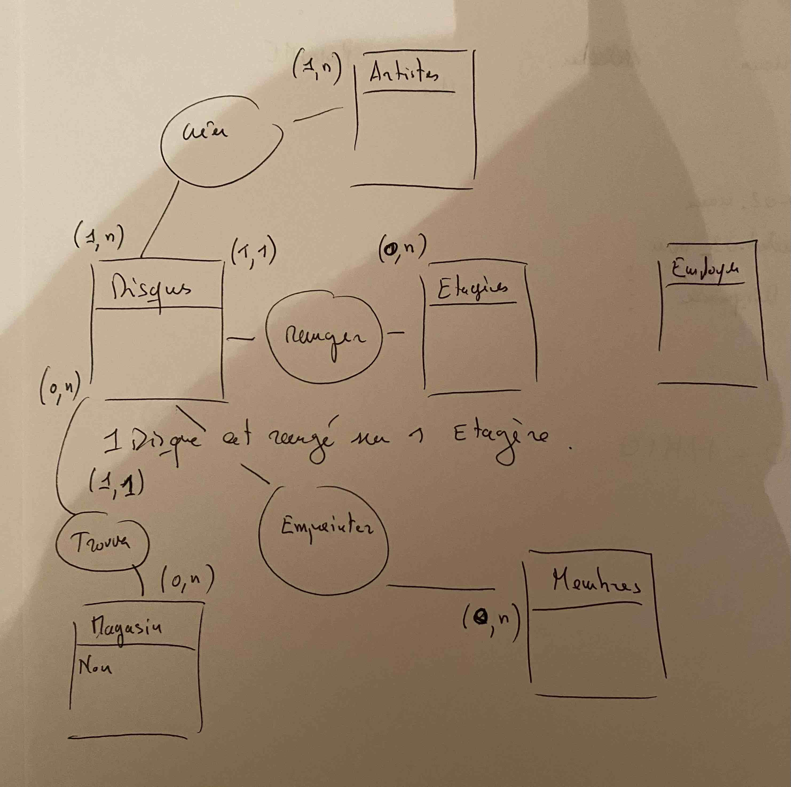

# Correction

1. Disques, Etageres, Membres, Employers, Artistes.

2.

Disques     
- titre
- date
- genre  

Etageres     
- nom
- largeur
- hauteur 

Membres     
- nom
- date_inscription
- adresse  
- email

Employers
- nom
- email
- adresse
- grade

Artistes
- nom
- adresse

3. Définissez maintenant simplement les relations entre les Entités à l'aide d'un verbe.

       (min, max)
Disques (1, n)  Créer  (0,n) Artistes
*1 Disque est créé par 1 ou plusieurs Artiste(s).*
*1 Artiste a créé 0 à n Disque(s).*

Disques (1,1) Ranger (0,n) Etagères
*1 disque est rangé sur 1 Etagère.*
*1 Etagere contient de 0 à n Disque(s).*

Disques (0,1) Empreinter (0, n) Membres
*1 disque est empreinté par 0 à 1 Membre.*
*1 Membre a empreinté de 0 à n Disque(s).*

4. Magasin

Magasin
- nom
- adresse

Disque (0,n) Trouver (0, n) Magasin
*1 Disque est trouvé dans 0 à n Magasin(s)*
*1 Magasin on trouve de 0 à n Disque(s).*

Schéma :

