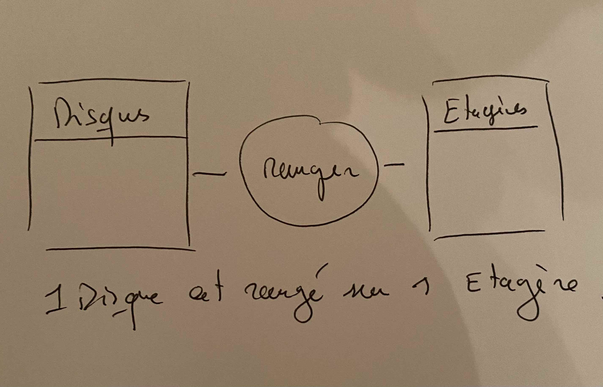
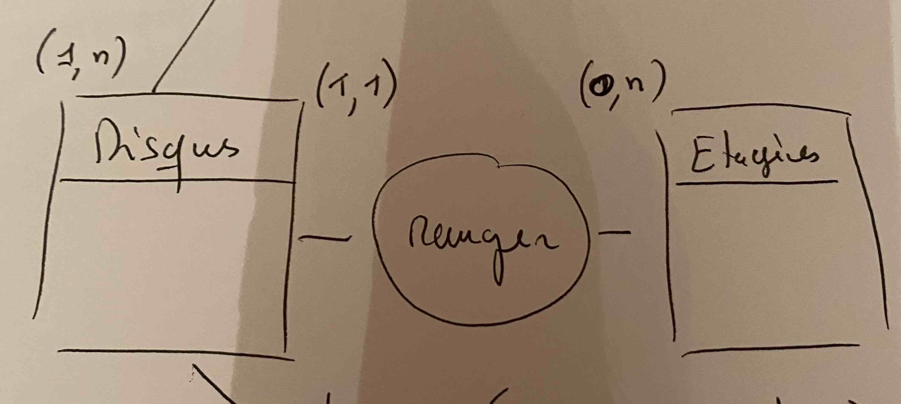
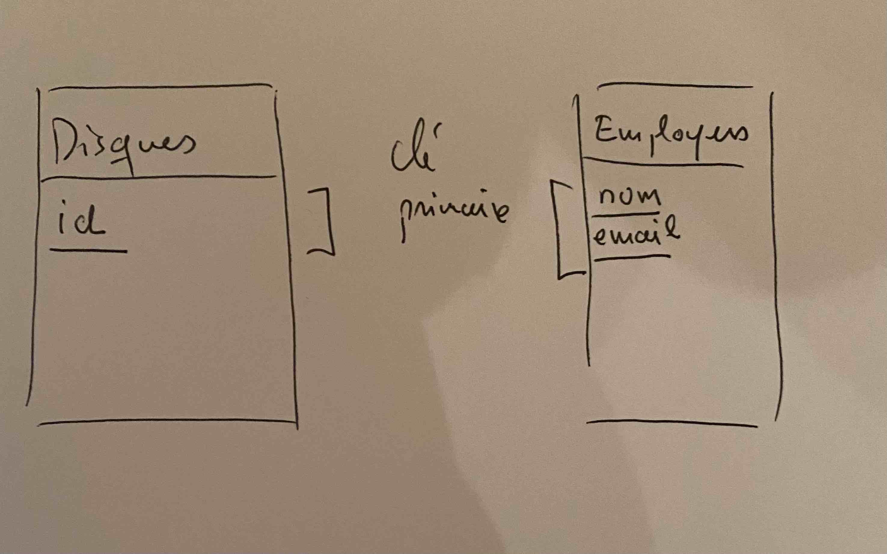

# Modelisation

Ne confondez pas la méthode Mérise et langage UML (Unified Modeling Language). La première s'attache à organiser l'information et la deuxième est plutôt utilisée dans les relations entre les classes métiers dans le développement d'une application. Par exemple dans le développement d'un système de réservation de billets d'avion en PHP, on modélisera en UML les relations entre les différentes classes métiers.

## Introduction à la méthode Mérise

Clairement elle est orientée données & base de données.

Comment organiser l'information que l'on possède dans un projet ? 

Des méthodes existent comme par exemple la méthode **Mérise**, inventée dans les années 1970. Elle a été définie pour organiser les données massives des entreprises ou organisation.

La méthode Mérise est issue de l'analyse systémique (analyse des système complexe).

Les mauvaises langues ont d'ailleurs trouvées un acronyme pour définir Mérise : *Méthode éprouvée pour Retarder Indéfiniment la Sortie des études.*

Pour résumer la méthode Mérise donne des étapes à l'analyse des données en vue de concevoir **un système logique automatique** pour gérer leurs échanges de manière relationnelle :

1. On part de l'expression d'un besoin : gérer une bibliothèque par exemple.
2. On fait un MCD => Modèle de conception des données
3. MLD => modèle logique des données. Le préalable nécessaire à la conception des tables d'une base de données.
4. MPD => Modèle physique des données : la base de données et les tables.

5. Automatisation de l'information (...)

## Application

Prenons un cahier des charges : une biliothèque de disques vinyles.

Remarque : une entité aura pour forme un tableau d'attribut(s) et de de valeur(s) tuples.

```text
Clients
-----------------
id  nom     adresse        <-- Attributs
1   Alan     Paris         <-- tuple de valeurs (1, Alan, Paris)
2   Alice    Marseille
3   Sophie   Lyon
```

Un attribut peut parfois avoir une valeur particulière : NULL. Dans ce cas, et uniquement dans ce cas, l'attribut en question peut ne pas contenir d'information, il sera alors préciser lors de la conception. La valeur NULL indique une **absence de l'information pour un tuple donné (valeurs)**.

```text
Clients
-----------------
id  nom     adresse        <-- Attributs
1   Alan     Paris         <-- tuple de valeurs (1, Alan, Paris)
2   Alice    Marseille
3   Sophie   Lyon
4   Michel   NULL          <-- absence d'information
```

### Exercice définir les Entités

1. Essayez d'imaginer 5 "Entités" pour une bibliothèque de disques vinyles en les écrivants sur une feuille de papier. 
*Par exemple une Etagère est une Entité appartenant à une bibliothèque.*

2. Décrivez maintenant les attributs de chaque Entité. Définissez au maximun 4 attributs.
*Par exemple le nom, largeur et hauteur sont les attributs d'une Etagère.*

Utilisez les Entités que nous avons trouvé à la question 1.

3. Définissez maintenant simplement les relations entre les Entités à l'aide d'un verbe. Vous pouvez faire un dessin sans les attributs.
*Pour se faire trouver un verbe qui relie deux Entités : un Disque est rangé sur une Etagère*



4. Définissez la cardinalité entre les relations. Regardez l'image ci-dessous vous codifiez les relations comme suit : (x,y).

*Un Disque est rangé sur une Etagère. Et une Etagère peut rangé de 0 à n Disque(s)*



## Exercice 2 shop

On crée l'Entité Magasin. On se demande si un disque que l'on prête à la bibliothèque se trouve dans un magasin. Essayez de traiter cette information dans notre MCD. Complétez le dessin que vous avez déjà fait.

## Exercice définir les types

Reprenez l'exercice précédent et définissez les types (number, string, Date, ...) de chaque attribut.

## Exercice clé primaire

Une clé primaire permet d'identifier dans nos Entités, **de manière unique**, un tuple ou une ligne de l'Entité. La clé primaire peut être définie par un ou plusieurs attribut(s). Par exemple nom, adresse ou le nom, prénom (...) dans l'Entité Employers :



Lorsque vous ne pouvez pas définir une clé à partir des attributs d'une Entité alors on ajoute un attribut id de type entier.

Une clé primaire définit une valeur ou un tuple de valeur unique. Elle ne peut également être nulle. Nous verrons également que dans une base de données elle définit un index pour optimiser les recherche.

Trouvez toutes les clés primaires des Entités.

## Association 1:N

Définition : c'est une association (relation) qui a les cardinalités maximales positionnées à 1 d'un côté de l'association et à n de l'autre. On rappelle que les relations sont définies naturellement comme suit : (min, max).

## Association N:N

Définition : c'est une association (relation) qui a les cardinalités maximales positionnées à n d'un côté de l'association et à n de l'autre. On rappelle que les relations sont définies naturellement comme suit : (min, max).

## Association 1:1

Définition : c'est une association (relation) qui a les cardinalités maximales positionnées à 1 d'un côté de l'association et à 1 de l'autre. On rappelle que les relations sont définies naturellement comme suit : (min, max).

```text
Disques(0,1)   représenter   (1,1)Images 1:1
```
De 0 à 1 disque est représenté par 1 image.
Et 1 image peut être représentée par 1 disque.

### Exercice associations

Trouvez toutes les relations 1:N, N:N et 1:1 dans notre projet si elles existent.

## Clé étrangère 1:N

Définition : Pour une relation 1:N, elle est créée dans l'association correspondante à l'Entité (x, 1), max est égal à 1. 
- Elle permet de mettre en relation deux Entités sans ambiguité. 
- Elle possède le même type que la clé primaire qu'elle référence. 
- Il n'y a pas de contrainte d'unicité (valeur unique) sur la clé étrangère.

Une Entité peut avoir plusieurs clés étrangères. Mais une Entité possède qu'une unique clé primaire.

## Schéma pour expliciter la relation 

Une clé étrangère référencera une clé primaire. La flèche part de l'entité possèdant la clé étrangère vers la clé primaire.


### Exemples

```text
               N:1
Clients (0,n) passer  (1,1) Commandes 

Clients
- id number PK
- nom string
- adresse string

Commandes
- code number PK
- date
- #id_client number  <-- création de la clé étrangère
```

Par exemple un client Alan a fait 4 commandes que l'on notera dans l'entité Commandes comme suit :

```text
Clients
-----------------
id  nom     adresse
1   Alan    Paris

Commandes
-----------------
code  date        #id_client number
1151  12/01/21    1
1152  13/01/21    1
1167  01/02/21    1
6517  21/02/21    1
```

### Exercice Clé étrangère

Déterminez toutes les clés étrangères dans les relations 1:N dans notre projet. Voyez l'exemple suivant :

## Association de type N:N

**Définition** : Une association de type N:N (cardinalité maximale des deux côtés) se traduit par la création d'une Entité composée des clés étrangères référençant les relations correspondantes aux Entités liées par l'association.

Une Entité de ce type peut être porteuse d'information. Voir l'exercice suivant.

### Exercice Entité N:N 

Complétez les attributs manquants pour les entités d'un magasin ci-dessous. Puis créez l'Entité de la relation correspondante (voir la définition plus haut) et enfin ajoutez les informations qui vous semble pertinente.

```text
Client
- nom string
- adresse string

Articles
- nom
```

### Exercice Projet relation

Reprendre le projet de la biliothèque de disques et trouvez toutes les Entités dans les relation N:N.
